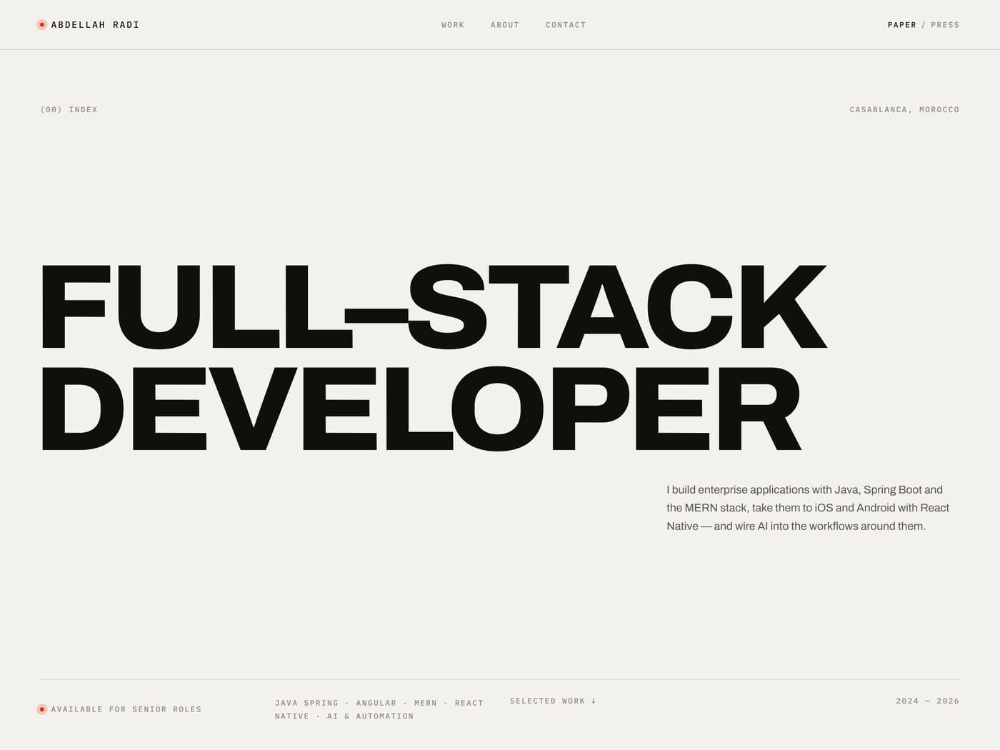
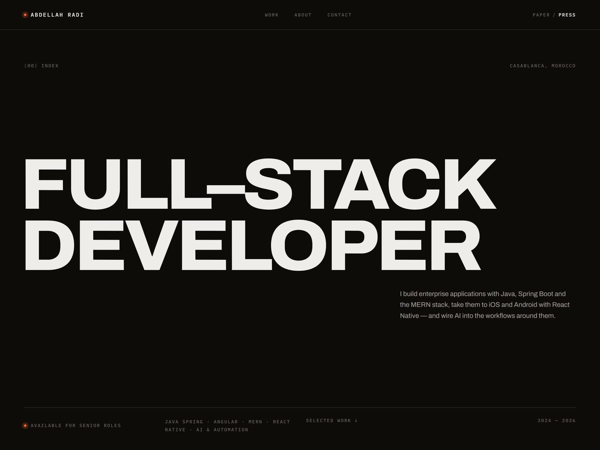
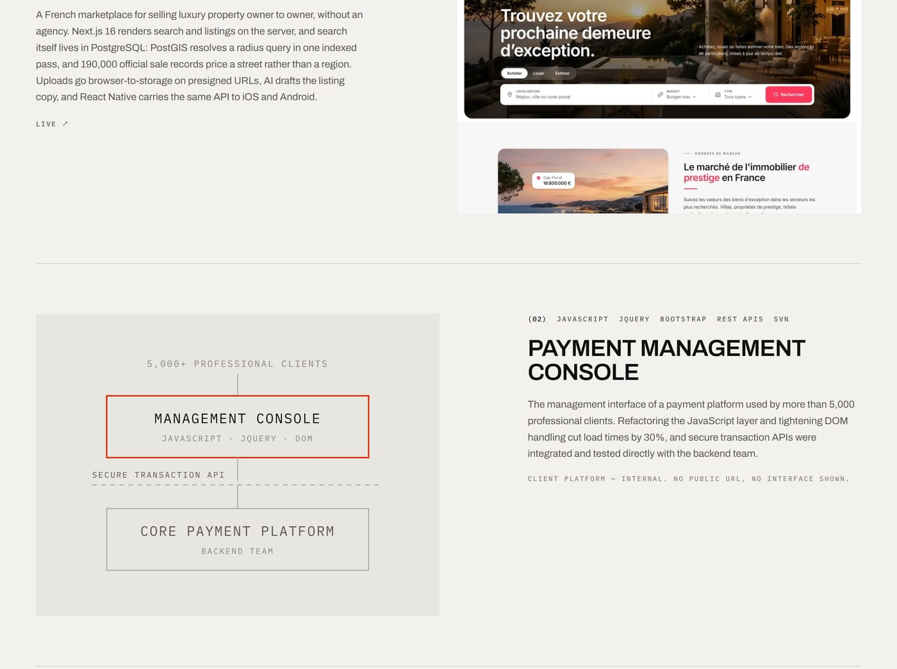
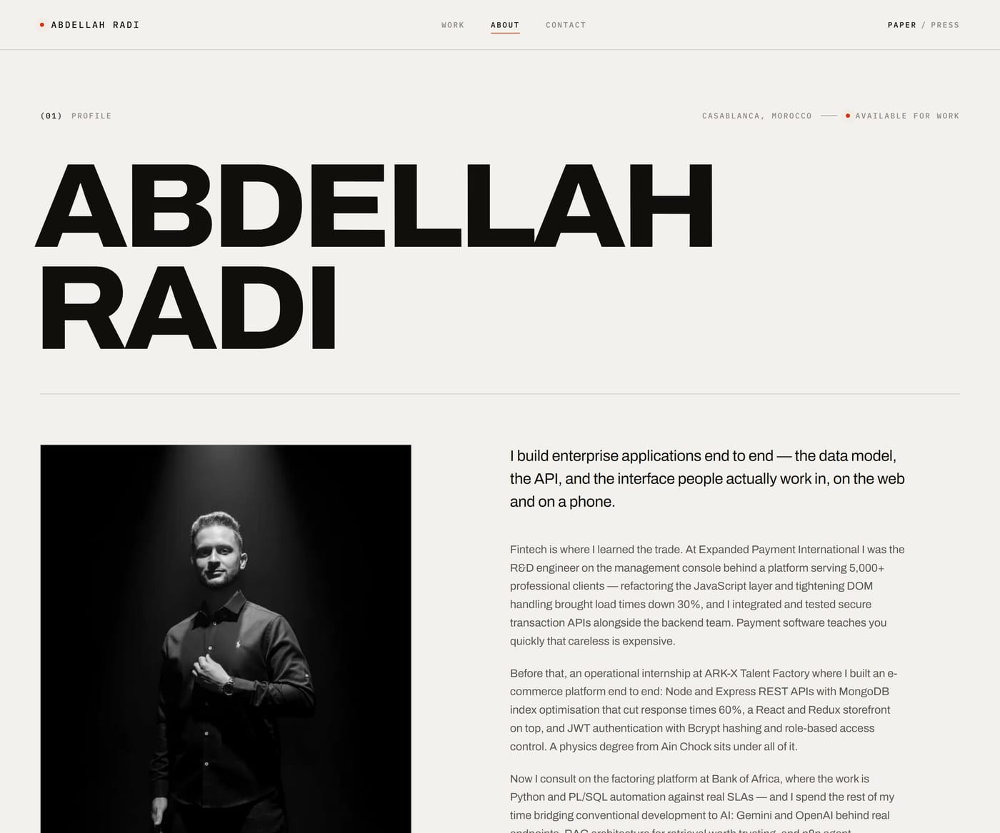
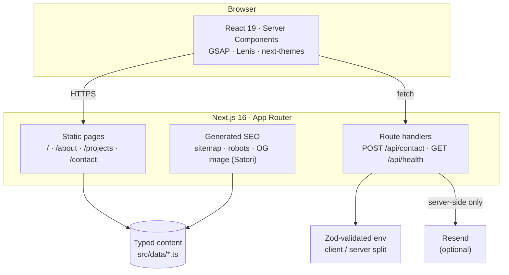
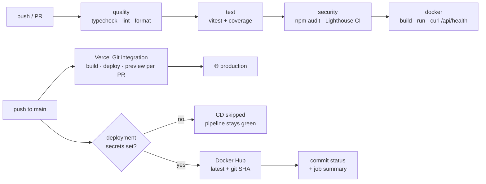

<div align="center">

# ◼ PRESSWORK

**An editorial-brutalist developer portfolio — typeset like print, animated like film, shipped like production software.**
Ink on paper · one accent colour · motion that degrades to nothing when you ask it to.

[](https://github.com/Abdo-Radi/my-portfolio/actions/workflows/ci.yml)
&nbsp;
[](#-quality-gates)
&nbsp;
[](./LICENSE)

<br/>


<br/>



</div>

---

## Overview

**Presswork** is my portfolio, built as a piece of production software rather than a landing page. It is set on a twelve-column editorial grid in two typefaces, driven by GSAP, and shipped through a gated CI/CD pipeline into a multi-stage Docker image.

The design system has a name and a rule set: **ink on paper, two neutrals, four greys, one accent**. No gradients, no elevation, no rounded corners — `borderRadius` is overridden to `0px` for every key in the Tailwind config, so rounding is *structurally impossible* rather than merely discouraged. Everything themes through CSS custom properties, so the whole palette inverts between **Paper** and **Press** without a single duplicated style.

The part I care most about is the motion. Nine GSAP primitives drive the entrances, the scroll and the micro-interactions — and every one of them sets its "from" state **in JavaScript, inside `gsap.matchMedia()`**. Turn JavaScript off, or ask for reduced motion, and every page still renders complete and readable. Nothing is hidden by CSS waiting for a script that may never arrive.

---

## ✨ Highlights

What makes this more than a template with a deploy button:

#### 🎬 Motion with a safety net

- **One GSAP entry point.** [`src/lib/gsap.ts`](src/lib/gsap.ts) registers the plugins once, guards for SSR, and exports a fixed vocabulary — `EASE` (`expo.out` / `expo.inOut` / `power2.out`) and `DUR`. No file outside that module imports from `"gsap"`, so registration can never be skipped and the easing language can't drift.
- **Progressive enhancement, actually enforced.** Every entrance is a `gsap.from()` inside a `matchMedia("(prefers-reduced-motion: no-preference)")` block. The "hidden" state only ever exists once the script has run, which is why the no-JS render is the *finished* page rather than a blank one.
- **Lenis on GSAP's clock.** Smooth scroll is driven from `gsap.ticker` instead of its own `requestAnimationFrame` loop — two RAF loops are what cause the classic one-frame jitter on scrubbed animations. It's skipped entirely on coarse pointers, because hijacking momentum scroll on touch feels broken, not premium.
- **A cover plate that follows the cursor.** On the home index, hovering a project lerps a single plate toward the pointer with `gsap.quickTo` — one interpolated setter per axis, never a tween per `mousemove`. React state decides only *which* project renders; the motion never touches the render cycle.

#### 🗂 Client work you can't screenshot

Two of the five projects are client systems that are internal and confidential — a payment console and a bank's factoring flows. Rather than publish screenshots I have no right to, or leave a conspicuous hole, each one gets:

- **A diagram plate** drawn from the same design tokens as everything else, so it inverts with the theme. Tiers, a dashed trust boundary, one vermilion rectangle marking the layer I owned — and **no client data whatsoever**.
- **A line where the links would be** — *"Client platform — internal. No public URL, no interface shown."* The absence sits in the slot the links would occupy, so it reads as a decision instead of an omission.

The registry is typed: `DIAGRAMS` is a total `Record<DiagramKey, ComponentType>`, so declaring a diagram in the data without drawing it is a **compile error**, not a blank plate.

#### 🛡 The API treated as an attack surface

[`POST /api/contact`](src/app/api/contact/route.ts) is small and assumes it's under attack:

- **Rate limited** to 3 requests per IP per hour, returning `429` with `Retry-After`, with opportunistic map cleanup so it can't grow unbounded.
- **Validated with Zod, then sanitised, then re-checked** — HTML tags and control characters are stripped *after* parsing, and an input that becomes empty as a result (`<b></b>`) is rejected rather than delivered blank.
- **Privacy-preserving logs.** A timestamp and a salted SHA-256 prefix of the IP. Never the name, the address, or the message. [A test asserts it](src/app/api/contact/route.test.ts): it posts a secret string and fails if that string appears anywhere in the captured log output.
- **Generic errors only** — no stack traces, no upstream detail.

#### 🧪 Tests that check the things that actually break

Beyond the unit tests, [`src/data/projects.test.ts`](src/data/projects.test.ts) guards the content layer:

- Every local cover image **must exist on disk** — a typo in a path ships a broken image to the home page and the archive, and no type system catches it.
- Every outbound link **must be absolute https**.
- Every slug must be unique, and every declared diagram must exist in the registry.

#### 🚦 Fail fast, everywhere

Strict TypeScript with `noUncheckedIndexedAccess`, Zod-validated environment variables that throw at boot rather than failing mysteriously at runtime, and a Husky pre-commit gate running ESLint + Prettier on staged files — so unformatted or broken code never reaches CI in the first place.

---

## 📸 Screenshots

|  |  |
| :--: | :--: |
| **Paper — the light theme** | **Press — the dark theme** |
|  |  |
| **Work — screenshots and diagram plates** | **About — the experience index** |
|  |  |

> Every colour in both themes is a CSS custom property. The toggle swaps tokens — not stylesheets, not a second build.

---

## 🏗 Architecture



Pages are statically prerendered; the two route handlers run on demand. Secrets are reached through a **lazily-evaluated** server env module that throws if it is ever touched from the client — so a stray import can't leak a key into the browser bundle.

---

## ⚙️ CI/CD pipeline



**CI** gates every push and pull request, and each stage gates the next. The `docker` job doesn't just build the image — it **runs the container and curls `/api/health`**, so a build that compiles but won't boot fails CI.

**CD** is opt-in. `cd.yml` and `pr-preview.yml` open with a `guard` job that checks whether the deployment credentials exist and short-circuits when they don't — so a fork, or a clone without secrets, gets a green pipeline instead of a wall of red crosses it can't fix. (The `secrets` context is readable in a step-level `if` but not a job-level one, which is why the check is hoisted into a job output.)

Day-to-day deployment is Vercel's Git integration: production from `main`, an isolated preview for every pull request.

---

## 🧰 Tech stack

| Layer | Technologies |
| --- | --- |
| **Framework** | Next.js 16 (App Router, Turbopack) · React 19 Server Components |
| **Language** | TypeScript 5.9 — `strict`, `noUncheckedIndexedAccess`, `noImplicitReturns` |
| **Styling** | Tailwind CSS v4 (CSS-first `@config`) · `oklch` design tokens · next-themes |
| **Motion** | GSAP 3.15 — ScrollTrigger + SplitText · `@gsap/react` · Lenis smooth scroll |
| **UI primitives** | shadcn/ui (new-york, owned in-repo) · Radix Slot · Sonner toasts |
| **Validation** | Zod 4 — request bodies *and* environment variables |
| **Typography** | Archivo (variable, `wdth` axis) · IBM Plex Mono — self-hosted via `next/font` |
| **Testing** | Vitest 4 · Testing Library · jsdom + node environments per file |
| **Quality** | ESLint 9 (flat config) · Prettier + Tailwind class sorting · Husky + lint-staged |
| **Infra** | Docker (multi-stage, standalone output, non-root) · GitHub Actions · Vercel · Dependabot |

---

## 📁 Repository layout

```text
my-portfolio/
├─ src/
│  ├─ app/                      # App Router
│  │  ├─ api/contact/route.ts   #   hardened contact endpoint (+ its tests)
│  │  ├─ api/health/route.ts    #   liveness probe, used by Docker + CI
│  │  ├─ opengraph-image.tsx    #   OG card generated with Satori
│  │  └─ sitemap.ts · robots.ts
│  ├─ components/
│  │  ├─ anim/                  #   9 GSAP primitives — the motion vocabulary
│  │  ├─ diagrams/              #   token-drawn SVG plates for confidential work
│  │  ├─ home/ · about/ · work/ #   page sections
│  │  └─ ui/                    #   shadcn primitives, restyled to the system
│  ├─ data/                     # typed content: projects, experience, skills, credentials
│  └─ lib/
│     ├─ gsap.ts                #   single GSAP entry point + easing vocabulary
│     └─ env.ts                 #   Zod-validated env, client/server split
├─ docs/screenshots/            # the images in this README
├─ .github/workflows/           # ci.yml · cd.yml · pr-preview.yml
├─ Dockerfile                   # deps → builder → runner (non-root, healthcheck)
└─ lighthouserc.json            # performance budgets enforced in CI
```

---

## 🛠 Local development

Prerequisites: **Node 20** (pinned in [`.nvmrc`](./.nvmrc)). Docker is optional.

```bash
git clone https://github.com/Abdo-Radi/my-portfolio.git
cd my-portfolio
npm ci
npm run dev          # http://localhost:3000
```

That's the whole setup — **every environment variable is optional** and the app runs with safe defaults. The contact form works without an email provider: it validates, sanitises and logs, it just doesn't deliver.

| Script | Does |
| --- | --- |
| `npm run dev` | Dev server (Turbopack) |
| `npm run build` / `npm start` | Production build / serve |
| `npm test` / `npm run test:coverage` | Vitest, with coverage |
| `npm run typecheck` | `tsc --noEmit` |
| `npm run lint` / `npm run format` | ESLint / Prettier |

<details>
<summary><strong>Optional · environment variables</strong></summary>

```bash
cp .env.example .env.local
```

| Variable | Scope | Purpose |
| --- | --- | --- |
| `NEXT_PUBLIC_SITE_URL` | build-time | Absolute URL for canonical links, sitemap and OG metadata |
| `RESEND_API_KEY` | server | Enables real contact-email delivery (logs only if unset) |
| `CONTACT_FROM_EMAIL` | server | Verified Resend sender address |
| `IP_HASH_SALT` | server | Salt for one-way IP hashing in logs — `openssl rand -hex 16` |

`NEXT_PUBLIC_*` values are inlined at **build** time, so the production URL must be present during `next build` — not merely at runtime.

</details>

<details>
<summary><strong>Optional · run it in Docker</strong></summary>

```bash
# compose — passes the build arg and loads an optional .env
docker compose up --build

# or build it directly, baking in the production URL
docker build --build-arg NEXT_PUBLIC_SITE_URL=https://example.com -t my-portfolio .
docker run --rm -p 3000:3000 my-portfolio
```

A multi-stage build on `node:20-alpine`: dependencies, then the compile, then a runtime layer that copies **only** the Next.js standalone output, the static assets and `public/`. It runs as a non-root user and ships a `HEALTHCHECK` that polls `/api/health`.

</details>

---

## 🔌 API

| Route | Method | Purpose |
| --- | --- | --- |
| `/api/contact` | `POST` | Contact form — rate limited, validated, sanitised, privacy-logged |
| `/api/health` | `GET` | Liveness probe — `{ status, timestamp }`, never cached |

```jsonc
// POST /api/contact
{ "name": "Ada", "email": "ada@example.com", "message": "Hello." }

// 200 → { "ok": true }
// 400 → { "error": "A valid email is required." }
// 429 → { "error": "Too many requests. Please try again later." }   + Retry-After
```

---

## 🔒 Security

| Measure | Protects against |
| --- | --- |
| Rate limiting — 3/IP/hour, `429` + `Retry-After` | Spam floods, brute force, email-quota exhaustion |
| HTML + control-character stripping, re-validated after | Stored/reflected XSS and markup injection |
| Salted-hash IP logging, message never logged | PII leakage if logs are exposed |
| Generic error responses | Information disclosure that aids reconnaissance |
| CSP, HSTS, `X-Frame-Options: DENY`, `X-Content-Type-Options`, Referrer-Policy, Permissions-Policy | Clickjacking, MIME sniffing, referrer leakage |
| Zod-validated env, server module guarded against client import | Misconfiguration, and secrets reaching the browser bundle |
| Non-root Docker user, standalone runtime layer | Container blast radius and supply-chain surface |
| Husky pre-commit gate · Dependabot (npm, Actions, Docker) | Unlinted code, and known transitive vulnerabilities |

> The rate limiter is in-memory, which is exact on a single container and best-effort across serverless instances. Backing it with Upstash Redis is the one-line upgrade if that matters.

---

## 📊 Quality gates

**40 tests across 6 files**, all green — API behaviour, component rendering, content-data integrity, and utilities.

Lighthouse CI runs on every push against a production build, with budgets enforced from [`lighthouserc.json`](./lighthouserc.json):

| Performance | Accessibility | Best practices | SEO |
| :--: | :--: | :--: | :--: |
| ≥ 80 | ≥ 90 | ≥ 90 | ≥ 90 |

Accessibility is designed in rather than audited on: a skip link, a real `<table>` for the experience index that keeps its semantics when it blockifies on mobile, `inert` on background content behind the mobile menu, live regions on the async surfaces, and a full keyboard path through every hover interaction.

---

## 📄 About

Built by **[Abdellah Radi](https://github.com/Abdo-Radi)** — full-stack developer in Casablanca. Java · Spring Boot · MERN · React Native · AI integration.

Released under the **[MIT License](./LICENSE)**. Feedback and stars welcome. 🌟
